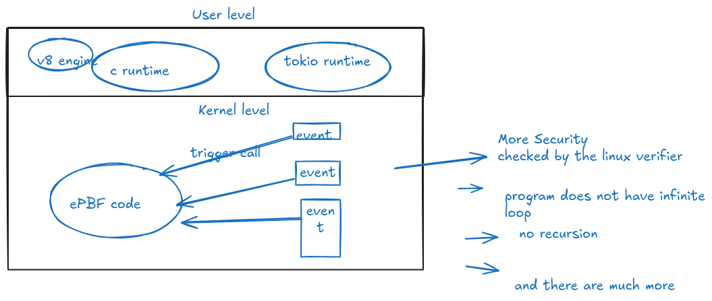

## eBPF(extended Berkeley packet filter)

* it is used in different context
* this epbf runs in the kernel space,which provides much strict security
### Overview

* **ePBF Programs** they are wwritten in c mostly but i will
be writing them in the rust in form of solana smart contracts
which will then be compiled to ePBF using the LLVM 

* **hooks** so different programs can be hooked to os level events so when they occur they could trigger those program

 * **Verifier:**  Before an eBPF program is loaded, a built-in verifier engine checks it for safety and stability. The verifier ensures the program terminates (no infinite loops), has valid memory access, and meets other security constraints.
 * **JIT compilation:**  After verification, a Just-in-Time (JIT) compiler translates the eBPF bytecode into native machine code. This allows the program to run with the speed of a natively compiled application.
 *   **eBPF maps:**  Maps are efficient key-value data structures that enable the sharing of data and state between the eBPF programs in the kernel and applications in user space.

### Why the verifer has so many rules for the code to run in the kernel

* Writing eBPF code to bypass the verifier" is generally not the goal of a developer. The verifier is the fundamental security mechanism that ensures your code is safe to run in the kernel

## Rules
### Program control flow

-   **Guaranteed termination:**  All program execution paths must have a guaranteed exit. Infinite loops are not allowed. The verifier can only approve loops if it can prove they will terminate, typically by checking a bounded loop counter.
-   **Limited complexity:**  The verifier has an internal complexity limit, meaning your program cannot be arbitrarily large or have an excessive number of potential execution paths. Large programs are often split into smaller programs that call each other via "tail calls".
-   **No recursion:**  Recursive function calls are strictly forbidden to prevent infinite execution.

### Memory and pointers

-   **No arbitrary memory access:**  eBPF programs cannot read or write to arbitrary kernel or user space memory. The verifier performs static analysis to ensure all memory accesses are within legal boundaries.
-   **Use helper functions:**  Interactions with the kernel, such as reading from user space or accessing kernel data structures, must be done through a predefined set of secure helper functions, not with raw pointers.
-   **Validate pointer return values:**  When a helper function returns a pointer, such as a map lookup, you must check for a  `NULL`  return before attempting to dereference it.
-   **Bounds checking for packet data:**  When processing network packets (e.g., in XDP programs), all accesses to the packet buffer must be explicitly checked against the  `data_end`  boundary pointer.
-   **No uninitialized reads:**  The verifier will catch any attempt to read from an uninitialized stack or register variable to prevent information leaks.
-   **Limited stack size:**  Each eBPF program has a small, fixed-size stack (typically 512 bytes). You must keep your program's local data and temporary variables within this limit.

### Data sharing with maps

-   **Restricted maps access:**  Programs can interact with a limited number of maps (up to 64).
-   **Match map access with type:**  Helper functions used to interact with a map must match the map's declared type. For example, a  `bpf_map_lookup_elem`  call on an array map will have different behavior than on a hash map.

### Program context

-   **Restricted helpers:**  Not all helper functions are available to every eBPF program type. The set of available helpers is determined by the program's attachment point.
-   **Correct program type:**  Your program must have a valid program type declared (e.g., XDP, tracepoint, kprobe), which is used by the loader to attach it to the correct kernel hook.
-   **Proper return value:**  Depending on the program type, the  `return`  value of your eBPF function may be interpreted differently by the kernel. For example, an XDP program returns an action code like  `XDP_DROP`  or  `XDP_PASS`.
 